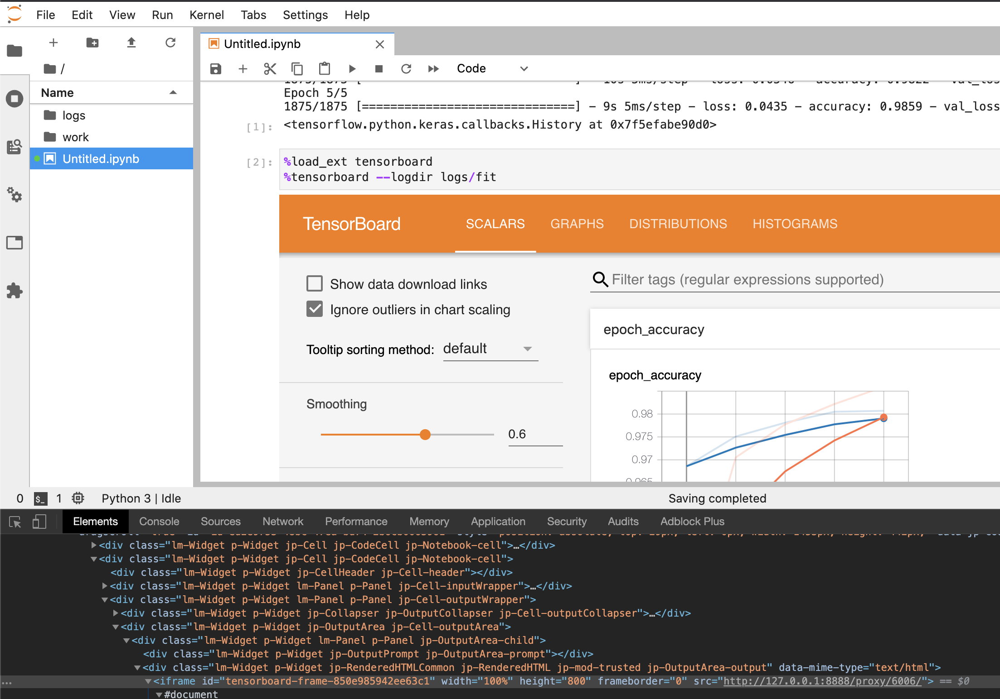
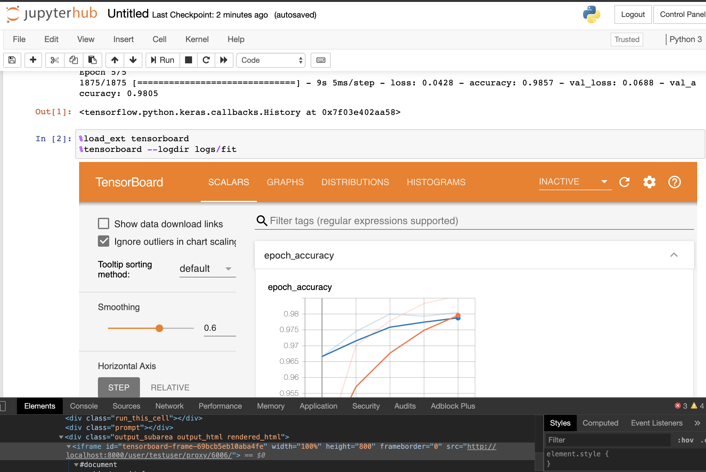

# TensorBoard jupyter-server-proxy Test

I've submitted a pull request to the TensorBoard project to enable integration
with [jupyter-server-proxy](https://github.com/jupyterhub/jupyter-server-proxy).

This is important for users who are in restrictive network environments without
the ability to expose the port that TensorBoard usually uses. Users can instead
use jupyter-server-proxy to send the web traffic for TensorBoard through the
running copy of Jupyter Notebook or JupyterLab.

The following documentation and examples are used to both verify functionality
and to show how to use the new feature.


### Building With Travis:

I used the existing `.travis.yml` config and added my fork to Travis-CI at:
https://travis-ci.com/github/zac-hopkinson/tensorboard. This was mainly as a way
for me to build the project to ensure my PR would build cleanly the first time.


### Building Python Wheel Locally:

The full CI script isn't needed for building of just the wheel. We can use the
`Dockerfile.build` script to build the wheel. The `notebook.py` file hasn't been
modified in 5 months so we can easily cherry pick the commit(s) with our changes
into any version's branch to build wheels of specific versions for testing.

To build TensorBoard 2.2.1 with our changes using Docker run:

```bash
docker \
  build \
  --build-arg TB_VER="2.2.1" \
  --build-arg CHERRY_PICK_COMMIT="60393f855337e2939483301684267d1655004918" \
  --no-cache \
  -t tensorboard_build:2.2.1 \
  -f Dockerfile.build \
  .
```

NOTE: Using `--no-cache` for iterations on the Git repo w/o Dockerfile changes.

You can grab the wheel from this image or start a container with it and upload
to PyPi.


#### Grab Wheel From Docker Image:

```bash
docker run --rm -d --name tensorboard_build tensorboard_build:2.2.1 sleep infinity
docker cp tensorboard_build:/tmp/tensorboard/bazel-bin/tensorboard/pip_package/pip_packages.tar.gz .
docker kill tensorboard_build
```


### Use Docker Image to Upload Wheel to TestPyPi:

This will let you upload the wheel to TestPyPi which makes testing easier.

```bash
docker run --rm -it tensorboard_build:2.2.1 bash
###
python3 -m pip install --upgrade pip keyrings.alt twine

cd /tmp/tensorboard/bazel-bin/tensorboard/pip_package
tar -xvzf pip_packages.tar.gz

# Upload it to TestPyPi under a different name
# We can't upload it under the tensorboard name of course, so we need to find a
# a way to rename the package in PyPi but keep the installed module called
# tensorboard. This was fun to figure out, but probably not a great idea...
unzip tensorboard-2.2.1-py3-none-any.whl
# Modify METADATA to be clear on what this is:
sed -i 's/Name: tensorboard/Name: tensorboardtmp/' tensorboard-2.2.1.dist-info/METADATA
sed -i 's/Summary: TensorBoard lets you watch Tensors Flow/Summary: For testing only/' tensorboard-2.2.1.dist-info/METADATA
sed -i 's/Author: Google Inc./Author: For testing only/' tensorboard-2.2.1.dist-info/METADATA
sed -i 's/Author-email: packages@tensorflow.org/Author-email: none@none.com/' tensorboard-2.2.1.dist-info/METADATA
echo "This is a test fork of TensorBoard to add support for jupyter-server-proxy using the TENSORBOARD_PROXY_URL environment variable." >> tensorboard-2.2.1.dist-info/METADATA
mv tensorboard-2.2.1.dist-info tensorboardtmp-2.2.1.dist-info
zip -r tensorboardtmp-2.2.1-py3-none-any.whl tensorboard tensorboardtmp-2.2.1.dist-info
# Upload it to TestPyPi:
python3 -m twine upload --repository testpypi tensorboardtmp-2.2.1-py3-none-any.whl
```

Now it can be installed from TestPyPi else for testing:

```bash
python \
  -m pip \
  install \
  --index-url https://test.pypi.org/simple/ \
  --extra-index-url https://pypi.org/simple \
  tensorboardtmp==2.2.1
```

We need to pull our test package from test.pypi.org and we do that with
`--index-url`, but we also need to install the package dependencies which aren't
all under test.pypi.org. We use `--extra-index-url` to install the dependencies.

Note: Install TensorFlow first if you're using it, then uninstall TensorBoard,
then install our custom version of TensorBoard. This is because TensorFlow will
install TensorBoard as a dependency, and our TensorBoard package does not share
the same name. See Dockerfile.lab for an example of this.


### Using/Testing:


#### Using With Own Environment

In your own environment running either Jupyter Notebook or JupyterLab you can
export the `TENSORBOARD_PROXY_URL` environment variable like below and
TensorBoard will embed in your notebook by sending traffic through
jupyter-server-proxy.

```bash
# pip install <our tensorboard>
# pip install jupyter-server-proxy
export TENSORBOARD_PROXY_URL="/proxy/%PORT%/"
jupyter lab
```

Inside of JupyerLab the IPython magic for Tensorboard should recognize the
environment variable set above and then embed TensorBoard in the notebook using
jupyter-server-proxy. You can use Chrome Dev Tools to confirm the IFRAME is
using the proxy url.


#### Using With JupyterLab



We can extend the official Jupyter Docker image to test these changes. This is a
great simple way to test inside of an isolated environment. By running it inside
of Docker we can also expose only the Jupyter port, so if we are able to view
TensorBoard we know it's working through the proxy. A simple example is in
[Dockerfile.lab](Dockerfile.lab). Build it by running:

```bash
docker build -t tb_test:jupyterlab -f Dockerfile.lab .
```

Then run it:

```bash
docker run --rm -it -p 8888:8888 tb_test:jupyterlab jupyter lab
```

It'll output a http://127.0.0.1:8888 URL with a token. Open that up in your
browser.

We can run a simple MNIST example from the
[Tensorboard documentation](https://www.tensorflow.org/tensorboard/get_started)
to make sure things work. You can skip this step and just launch TensorBoard,
but it's more fun to have a bit of data loaded into TensorBoard to sanity check
things.

Open a new Jupyter Notebook and run the following:

```python
import tensorflow as tf
import datetime

mnist = tf.keras.datasets.mnist

(x_train, y_train),(x_test, y_test) = mnist.load_data()
x_train, x_test = x_train / 255.0, x_test / 255.0

def create_model():
    return tf.keras.models.Sequential([
        tf.keras.layers.Flatten(input_shape=(28, 28)),
        tf.keras.layers.Dense(512, activation='relu'),
        tf.keras.layers.Dropout(0.2),
        tf.keras.layers.Dense(10, activation='softmax')
    ])

model = create_model()
model.compile(optimizer='adam',
              loss='sparse_categorical_crossentropy',
              metrics=['accuracy'])

log_dir = "logs/fit/" + datetime.datetime.now().strftime("%Y%m%d-%H%M%S")
tensorboard_callback = tf.keras.callbacks.TensorBoard(log_dir=log_dir, histogram_freq=1)

model.fit(x=x_train, 
          y=y_train, 
          epochs=5, 
          validation_data=(x_test, y_test), 
          callbacks=[tensorboard_callback])
```

Now test the `%tensorboard` magic:

```
%load_ext tensorboard
%tensorboard --logdir logs/fit
```

You should see TensorBoard displayed. Because we started the Docker image with
only the JupyterHub port exposed, we can be sure that it's going through
jupyter-server-proxy.

You can also test that the dynamic port logic works by starting up a service
on port 6006 before starting TensorBoard, or adding `--port` to the TensorBoard
arguments.


#### Using With JupyterHub



We can also test with JupyterHub. The [Dockerfile.hub](Dockerfile.hub) file
contains an extremely simplified JupyterHub installation that we can use to test
the code change with.

The magic to getting this to work is to set our new environment variable in the
JupyterHub Spawner and use the base url in it.

There are at least two different ways to do this. The first option is to
customize your JupyterHub settings (`jupyterhub_config.py`) to add the
`TENSORBOARD_PROXY_URL` environment variable using JupyterHub's base URL for the
spawner. This can be done with a callable like so:

```python
def setup_tensorboard_proxy(spawner):
    if spawner.server:
        env = spawner.server.base_url
        return env + "proxy/absolute/%PORT%/"
    return ""

c.Spawner.environment = {
    "TENSORBOARD_PROXY_URL": setup_tensorboard_proxy
}
```

Documentation: https://jupyterhub.readthedocs.io/en/stable/api/spawner.html#jupyterhub.spawner.Spawner.environment

Another option that might also work in most cases without needing the user's
URL prefix is to use JupyterHub's `user-redirect` URL. The config is like this:

```python
c.Spawner.environment = {
    "TENSORBOARD_PROXY_URL": "/hub/user-redirect/proxy/%PORT%/"
}
```

Documentation: https://jupyterhub.readthedocs.io/en/stable/reference/urls.html#user-redirect

The example uses the first method. To test it inside of JupyterHub, build the
Docker image like this:

```bash
docker build -t tb_test:jupyterhub -f Dockerfile.hub .
```

Then run JupyterHub in our Docker container:

```bash
docker run --rm -it -p 8000:8000 tb_test:jupyterhub
```

Open http://localhost:8000/ and login with username `testuser` and any password.
Wait for your notebook to spawn. Open a terminal and install TensorFlow and
our testing copy of TensorBoard:

```bash
python3 -m pip install --user tensorflow==2.2.0
python3 -m pip uninstall -y tensorboard
python3 \
  -m pip \
  install \
  --user \
  --index-url https://test.pypi.org/simple/ \
  --extra-index-url https://pypi.org/simple \
  tensorboardtmp==2.2.1
```

Close the terminal browser window. Create a new notebook. Copy and run the
MNIST exmaple from above. Then use the IPython magic to launch TensorBoard:

```
%load_ext tensorboard
%tensorboard --logdir logs/fit
```

You should see TensorBoard being proxied through jupyter-server-proxy.


### TODO

  * Add documentation to TensorBoard
  * Related: https://github.com/tensorflow/tensorboard/pull/3142
